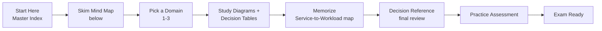
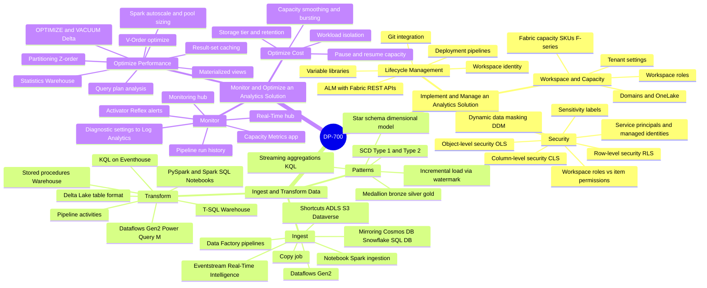
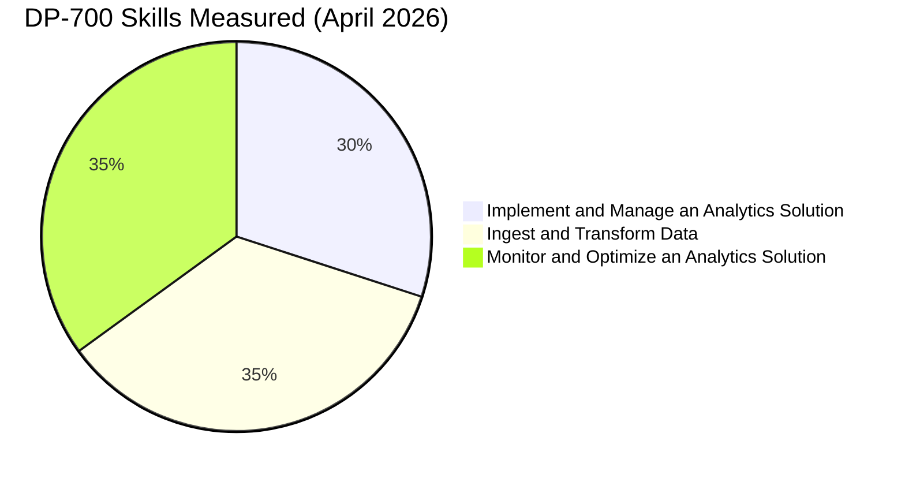
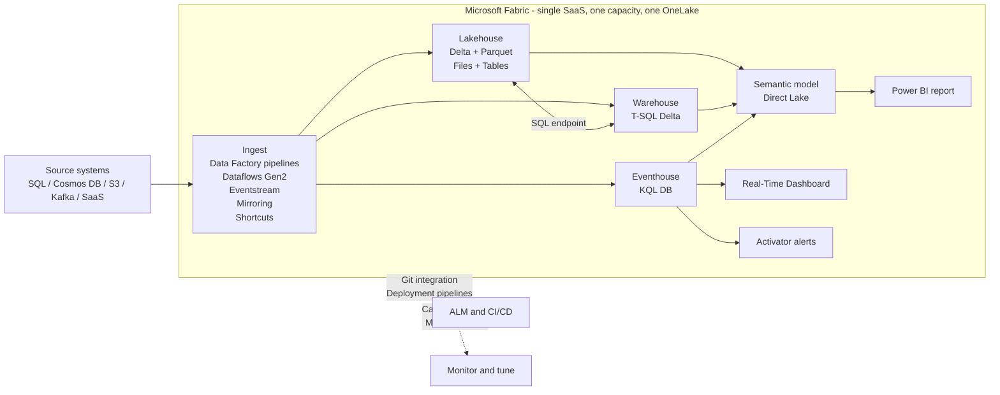
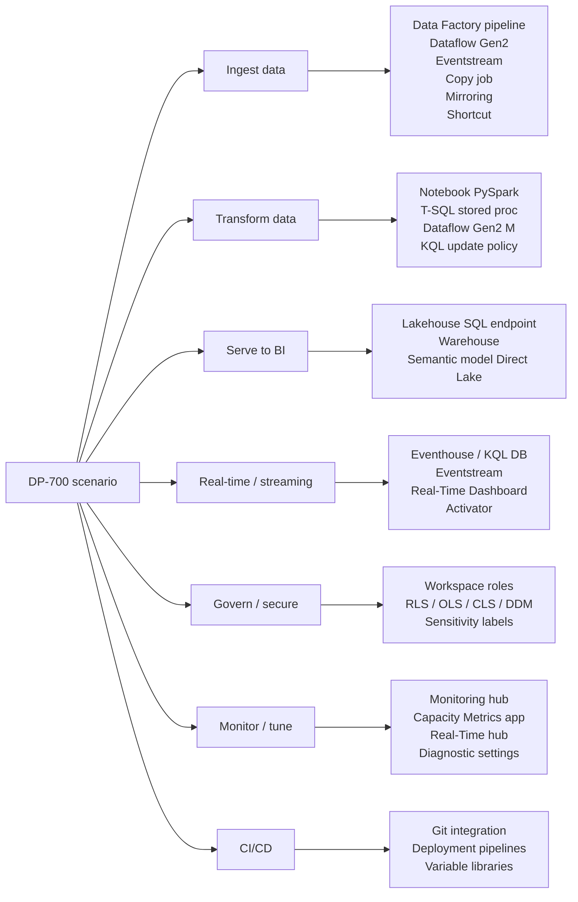
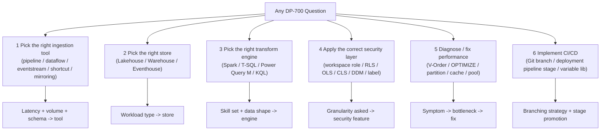
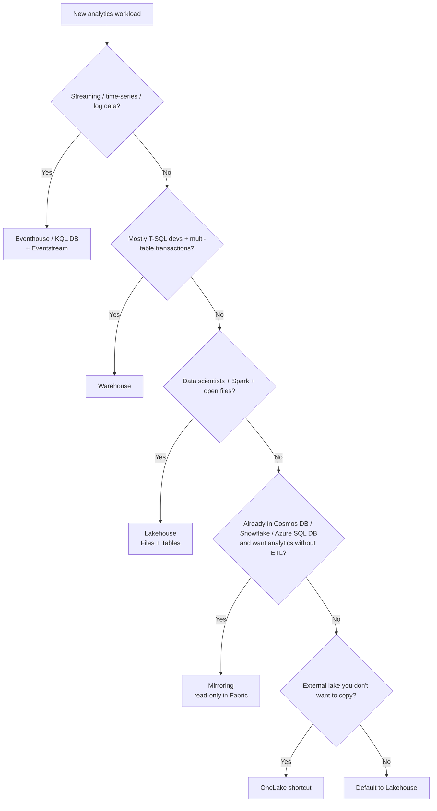
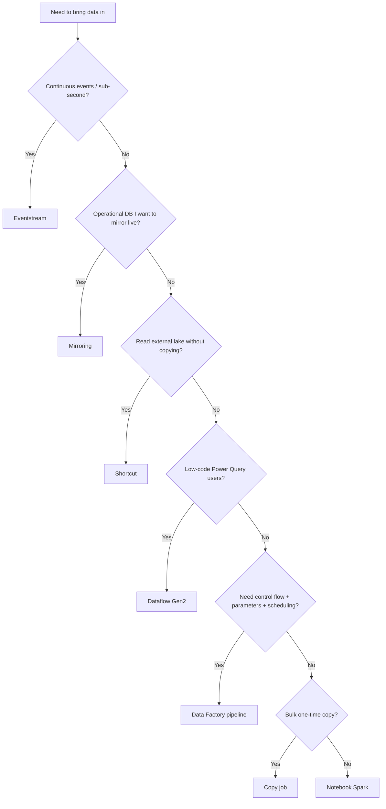
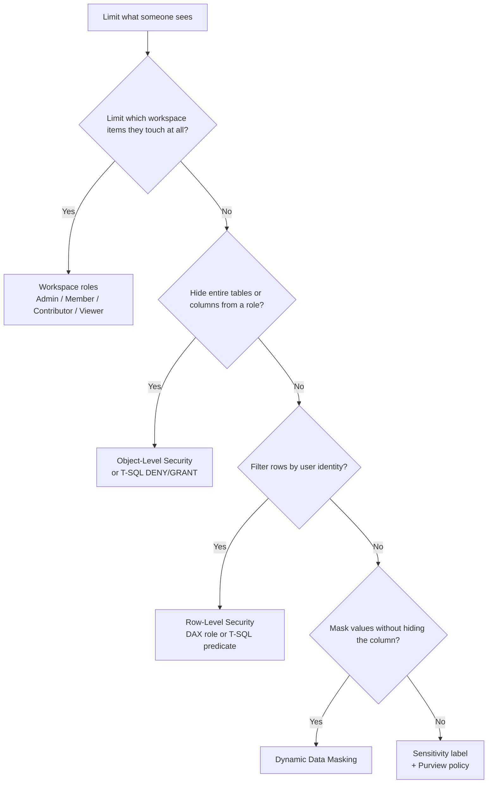

# DP-700 Visual Study Guide - Master Index

> **Microsoft Certified: Fabric Data Engineer Associate**
> Concept-only study layer. Aligned to the official [DP-700 study guide](https://learn.microsoft.com/credentials/certifications/resources/study-guides/dp-700) and the [exam page](https://learn.microsoft.com/credentials/certifications/exams/dp-700/) (skills measured as of **April 2026**). No exam questions reproduced.

DP-700 tests whether you can **implement and operate end-to-end analytics solutions on Microsoft Fabric** - Lakehouse, Warehouse, Real-Time Intelligence (KQL/Eventhouse), Data Factory pipelines, Dataflows Gen2, Notebooks/Spark, security, monitoring, CI/CD with Git, and performance tuning across all Fabric workloads.

---

## How to use this guide

---

## The 3 Exam Domains - Mind Map

---

## Official skills weighting

| # | Domain | Weight | File |
|---|---|---|---|
| 1 | Implement and Manage an Analytics Solution | **30-35%** | [01-implement-manage.md](01-implement-manage.md) |
| 2 | Ingest and Transform Data | **30-35%** | [02-ingest-transform.md](02-ingest-transform.md) |
| 3 | Monitor and Optimize an Analytics Solution | **30-35%** | [03-monitor-optimize.md](03-monitor-optimize.md) |
| | **Exam Decision Reference** | - | [05-exam-cheatsheet.md](05-exam-cheatsheet.md) |
| | **Concept & Reference Index** | - | [06-references.md](06-references.md) |
| + | **Extra Concepts** | - | [07-extra-dp700-concepts.md](07-extra-dp700-concepts.md) |
| + | **Microsoft Learn Summaries** | - | [08-learn-summaries.md](08-learn-summaries.md) |
| + | **Architectures - DP-700** | - | [09-arch-dp700.md](09-arch-dp700.md) |

---

## Microsoft Fabric - the one diagram you must memorize

The smallest set of Fabric concepts to memorize: **Capacity (F-SKU), Workspace, Domain, OneLake, Lakehouse, Warehouse, Eventhouse / KQL DB, Eventstream, Data Factory pipeline, Dataflow Gen2, Notebook (Spark), Shortcut, Mirroring, Semantic model (Direct Lake / Import / DirectQuery), Activator (Reflex), Real-Time Dashboard, Monitoring hub, Capacity Metrics app, Git integration, Deployment pipeline, Variable library.**

---

## Service-to-workload quick map

---

## The 6 Question Patterns You Will See

---

## The "Magic Words" Translator (DP-700 -> Service)

| When the question says... | Pick this Fabric service / feature | Why |
|---|---|---|
| "low-code visual data prep using Power Query" | **Dataflow Gen2** | Power Query M, Gen2 outputs to Lakehouse/Warehouse/KQL/SQL DB. |
| "schedule a multi-step ETL with control flow + parameters" | **Data Factory pipeline** | Activities, control flow, expressions, scheduling. |
| "near-real-time replicate of Cosmos DB / Snowflake / Azure SQL DB into Fabric" | **Mirroring** | Continuous CDC into a Mirrored database, queryable as Delta. |
| "expose external ADLS / S3 / Dataverse data as Fabric tables without copying" | **OneLake shortcut** | Virtual reference, no data movement. |
| "ingest a stream of clicks / IoT / Kafka events" | **Eventstream -> Eventhouse / KQL DB** | Real-Time Intelligence pattern. |
| "trigger an action when a metric crosses a threshold" | **Activator (Data Activator / Reflex)** | Rule-based alerting on streams or Power BI. |
| "interactive ad-hoc T-SQL across petabytes of Delta" | **Warehouse** | Full-T-SQL multi-table transactions. |
| "Spark SQL / PySpark notebooks reading Delta files" | **Lakehouse + Notebook** | Files + Tables area, Spark engine. |
| "log analytics, time series, KQL queries" | **Eventhouse / KQL Database** | Optimized for telemetry + KQL. |
| "Power BI report with no data import / refresh, hits Delta directly" | **Direct Lake semantic model** | Reads OneLake parquet files at query time. |
| "high-perf cached BI model with scheduled refresh" | **Import semantic model** | In-memory VertiPaq engine. |
| "row-level filter so Sales East only sees East rows in Power BI" | **Row-Level Security (RLS)** | DAX role on Power BI semantic model OR T-SQL RLS in Warehouse. |
| "hide columns containing salary from analyst role" | **Object-Level Security (OLS) / Column-level security** | OLS hides at semantic model; CLS via GRANT in Warehouse. |
| "show only last 4 digits of credit card to non-privileged readers" | **Dynamic Data Masking (DDM)** | Column-level masking in Warehouse / SQL DB. |
| "tag dataset as Confidential and have Purview track it" | **Sensitivity labels (Microsoft Purview Information Protection)** | Inherits through pipelines + reports. |
| "promote tested artifacts from Dev -> Test -> Prod with rules" | **Deployment pipelines** | Built-in 3-stage with deployment rules + variables. |
| "version-control workspace items as YAML/JSON in a repo" | **Git integration (Azure DevOps / GitHub)** | Branch-based dev per workspace. |
| "store environment-specific connection strings outside item code" | **Variable library** | Reusable variables per stage. |
| "rebuild Delta files for fast scan after many small writes" | **OPTIMIZE + VACUUM** | Compaction + tombstone cleanup. |
| "Power BI scan time too slow on a Lakehouse table" | **Enable V-Order + OPTIMIZE** | V-Order = Fabric's column sort for Vertipaq read-perf. |
| "Spark job runs out of memory on a wide group-by" | **Increase pool size / use larger node / repartition** | Resource + skew fix. |
| "see who ran what pipeline and when" | **Monitoring hub** | Cross-workspace run history. |
| "see capacity unit consumption per item" | **Capacity Metrics app** | F-SKU CU usage drill-down. |
| "Spark notebook keeps timing out at startup" | **Starter pool / custom Spark pool / autoscale** | Cold-start vs warm pool. |
| "incrementally load only new rows since last run" | **Watermark column + lookup activity / MERGE** | Standard incremental pattern. |
| "Type 2 SCD on dimension table" | **MERGE with end-date + current-flag** | T-SQL Warehouse or Spark Delta MERGE. |

---

## Decision tree - pick the right Fabric store

---

## Decision tree - pick the right ingestion tool

---

## Decision tree - pick the right security feature

---

## Top "gotchas"

- **Lakehouse vs Warehouse.** Lakehouse = files + tables, multi-engine (Spark, T-SQL via SQL endpoint, KQL via shortcut). Warehouse = T-SQL with full multi-table transactions and stored procs. **Lakehouse SQL endpoint is read-only T-SQL - no INSERT/UPDATE/DELETE there.**
- **Direct Lake vs DirectQuery vs Import.** Direct Lake reads OneLake parquet files at query time (best of both worlds, but falls back to DirectQuery on unsupported features). Import = in-memory cache. DirectQuery = live queries to source.
- **Mirroring is read-only in Fabric** and free for storage; you cannot write into a mirrored database from Fabric.
- **Shortcuts != Mirroring.** Shortcut = symbolic link to existing data (ADLS, S3, Dataverse, another OneLake). Mirroring = continuous CDC replication.
- **Eventhouse = container; KQL Database = item.** A KQL DB lives inside an Eventhouse. KQL queryset is a separate item that points at one or more KQL DBs.
- **Activator (Data Activator / Reflex)** is the alerting service. It listens to Eventstreams, KQL queries, or Power BI metrics and triggers actions.
- **V-Order** is a Fabric-specific Parquet write-time optimization that improves Power BI Direct Lake read perf. It costs ~15% extra CPU at write but pays back many-fold on read.
- **OPTIMIZE compacts small Delta files; VACUUM removes old versions** older than the retention threshold (default 7 days). Run VACUUM only after OPTIMIZE and never with retention set below 7 days unless you set the bypass flag.
- **Capacity != workspace.** A Fabric capacity (F-SKU) is the billing/compute boundary. Workspaces are assigned to one capacity. Workspace = governance + permissions boundary.
- **Domains** group workspaces by business unit; they are NOT the security boundary - workspace roles still rule.
- **Git integration is per-workspace, branch-per-developer.** Deployment pipelines move artifacts between Dev / Test / Prod stages **without touching Git** (they read live workspace state). Most teams use both: Git for source, deployment pipelines for promotion.
- **Variable library** (GA in 2025) replaces ad-hoc parameter management for environment-specific values across pipelines, dataflows, notebooks.
- **Spark Starter Pool is shared and warm; custom pools cold-start.** Use custom pools when you need specific node sizes or library bundles, but expect ~2-3 min startup.
- **Capacity Metrics app** is the single source of truth for "is my F-SKU sized right?" - drill into "Throttling" tab when reports get slow.

---

## Supporting pages in this guide

| File | Purpose |
|---|---|
| [05-exam-cheatsheet.md](05-exam-cheatsheet.md) | All decision trees + "magic words" translator in one printable page |
| [06-references.md](06-references.md) | Every concept linked to Microsoft Learn |
| [07-extra-dp700-concepts.md](07-extra-dp700-concepts.md) | Edge-case concepts (Spark advanced tuning, KQL update policies, materialized views) |
| [08-learn-summaries.md](08-learn-summaries.md) | Per-service summary matching Microsoft Learn module headlines |
| [09-arch-dp700.md](09-arch-dp700.md) | Reference architectures - medallion, real-time, mirroring, hybrid |
| [11-microsoft-resources.md](11-microsoft-resources.md) | Curated link library |
| [12-glossary.md](12-glossary.md) | Glossary + acronyms |
| [13-flashcards.md](13-flashcards.md) | Click-to-flip active recall flashcards |
| [14-pitfalls.md](14-pitfalls.md) | Common exam traps |
| [15-hands-on-labs.md](15-hands-on-labs.md) | Free Microsoft Learn sandbox labs |
| [16-architecture-center.md](16-architecture-center.md) | Architecture Center patterns |
| [17-copilot-quiz.md](17-copilot-quiz.md) | AI Copilot practice exam launcher |
| [99-video-tutorials.md](99-video-tutorials.md) | Video walkthroughs |
| [99-practice-assessment.md](99-practice-assessment.md) | Official Microsoft practice link |

---

**Next:** open [01-implement-manage.md ->](01-implement-manage.md)
