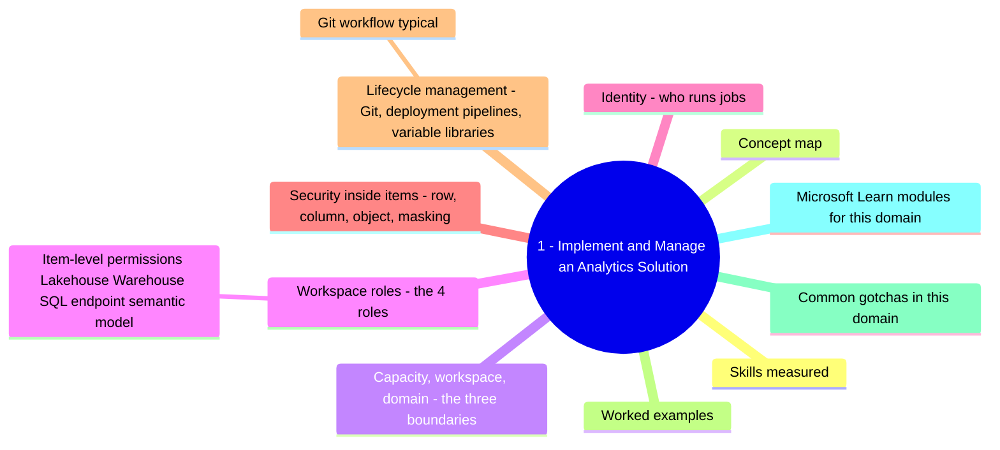
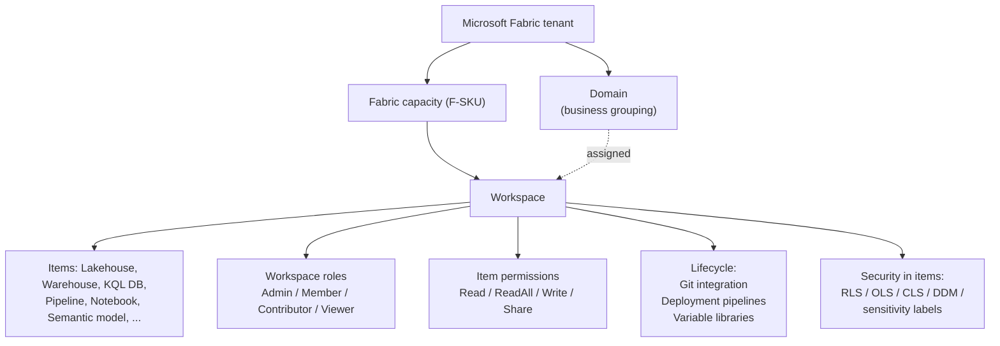
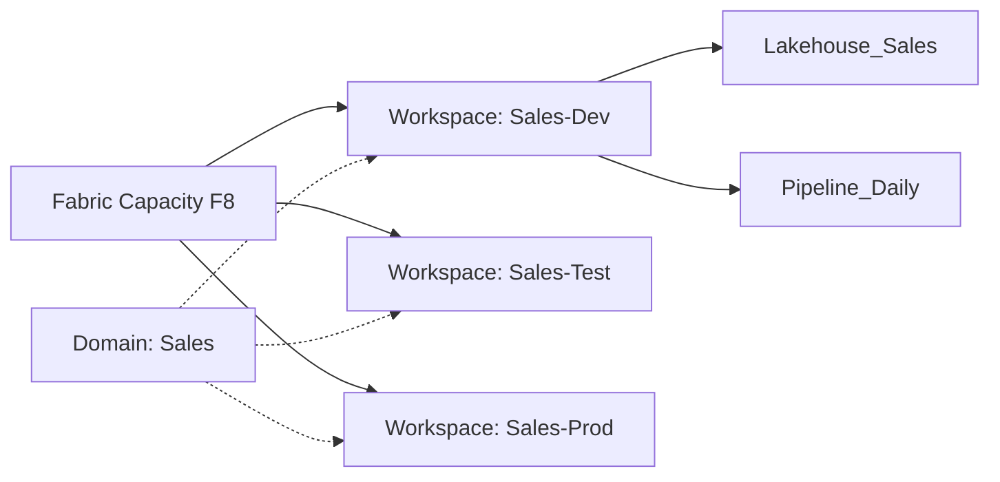
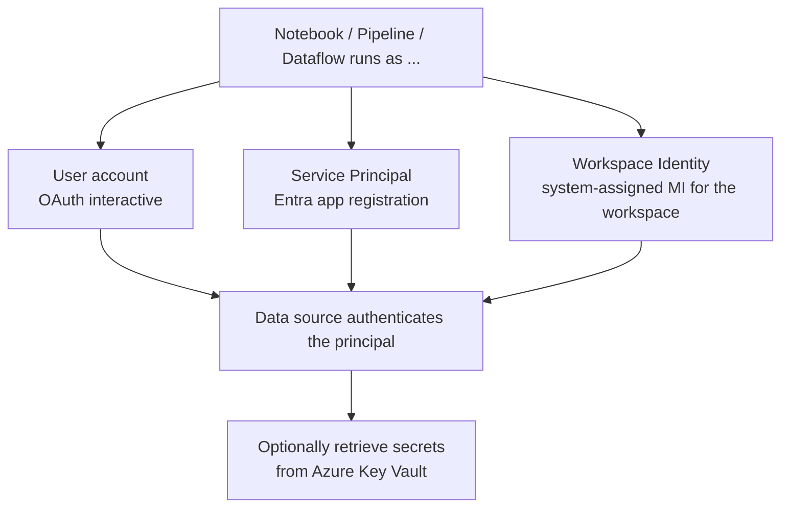
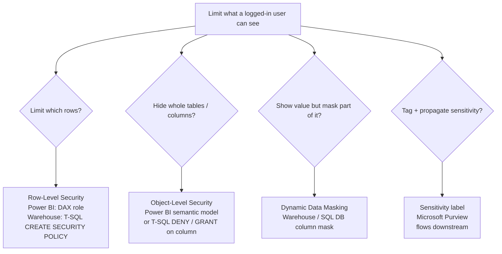
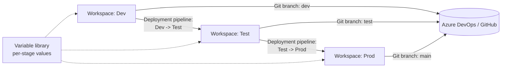
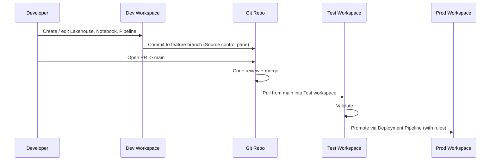

# 1 - Implement and Manage an Analytics Solution

> Domain 1 of DP-700. Weight: **30-35%**. The "set up Fabric properly and govern it" domain - capacity, workspaces, security, and lifecycle (Git + deployment pipelines).

## Domain mind map

## Skills measured

- **Configure Microsoft Fabric workspace settings** - capacity assignment, workspace roles, domains, OneLake, tenant settings.
- **Implement lifecycle management** - Git integration, deployment pipelines, variable libraries, workspace identity, ALM via REST APIs.
- **Configure security and governance** - workspace roles vs item permissions, RLS / OLS / CLS / DDM, sensitivity labels, service principals, managed identities.

> Source: [DP-700 study guide](https://learn.microsoft.com/credentials/certifications/resources/study-guides/dp-700).

---

## Concept map

---

## Capacity, workspace, domain - the three boundaries

| Boundary | What it controls | Example |
|---|---|---|
| **Capacity (F-SKU)** | Compute + billing. CU consumption is metered against this. | F2, F4, F8, ..., F2048. Pay-as-you-go or reserved. |
| **Workspace** | Permissions + governance + Git branch | "Sales-Analytics-Dev" workspace assigned to F8 capacity. |
| **Domain** | Business grouping for discovery + endorsement | "Finance" domain, contains 12 workspaces across BUs. |

> **Trap:** Domain is **organizational metadata**, not a security boundary. Permissions are still set per workspace.

---

## Workspace roles - the 4 roles

| Role | Can edit items? | Can manage permissions? | Can publish reports? | Can manage workspace settings? |
|---|---|---|---|---|
| **Admin** | Yes | **Yes** | Yes | **Yes** |
| **Member** | Yes | Add Contributors/Viewers | Yes | No |
| **Contributor** | Yes | No | Yes | No |
| **Viewer** | **No** | No | View only | No |

> **Magic words:**
> "User must edit pipelines but not give others access" -> **Contributor**.
> "User must add new viewers" -> **Member**.
> "User must change capacity / delete workspace" -> **Admin**.

### Item-level permissions (Lakehouse / Warehouse / SQL endpoint / semantic model)

- **Read** - connect to the SQL endpoint.
- **ReadAll (also called Build)** - read all underlying data via OneLake / SQL endpoint.
- **Write / Share / ReshareWithSameRights** - additional item-level grants.

> Workspace role + item permission combine: a **Viewer** in the workspace can still be granted **ReadAll** on a specific Lakehouse to consume Power BI reports built on Direct Lake.

---

## Identity - who runs jobs

| Identity | When to use | DP-700 cue |
|---|---|---|
| **User account** | Ad-hoc dev / testing | "developer running interactively" |
| **Service principal** | Automated pipelines, CI/CD, REST API automation | "use a non-human identity to run scheduled refresh" |
| **Workspace identity** | Workspace-owned access to Azure resources (ADLS, Key Vault, SQL DB) without per-user grants | "grant workspace access to a storage account" |
| **Managed identity (UA / SA)** | Same as Azure - workspace identity is Fabric's flavor | "no secret to manage, Entra-issued token" |

---

## Security inside items - row, column, object, masking

| Feature | Where it lives | Granularity | Bypass note |
|---|---|---|---|
| **RLS** | Semantic model (DAX role) **or** Warehouse (T-SQL `CREATE SECURITY POLICY`) | Row | Membership in role decides filter. |
| **OLS** | Semantic model | Column / table | Hides metadata too. |
| **CLS** | Warehouse (T-SQL `GRANT/DENY` on columns) | Column | SELECT * fails if user lacks permission. |
| **DDM** | Warehouse / SQL DB | Column (output mask) | Users with `UNMASK` permission see real value. |
| **Sensitivity label** | Item-level (set in Fabric / Purview) | Whole item | Inherits to derived items + exports. |

> **DDM is NOT encryption.** It is a presentation-layer mask. Privileged users still see raw values. Use **Always Encrypted** or column encryption if you need cryptographic protection.

---

## Lifecycle management - Git, deployment pipelines, variable libraries

| Tool | Purpose | When to use |
|---|---|---|
| **Git integration** | Source-control item definitions | Branch-per-feature dev. Reviewable diffs. |
| **Deployment pipelines** | Promote artifacts between Dev / Test / Prod stages with deployment rules + parameter rebinding | Release management without touching Git. |
| **Variable library** | Centralized, environment-specific variables consumed by pipelines, dataflows, notebooks | Connection strings, container names, capacity IDs that differ per stage. |
| **Fabric REST API + PowerShell / Python SDK** | Automated provisioning, bulk operations | CI/CD glue, custom landing zones. |

### Git workflow (typical)

> **Trap:** Deployment pipelines do **not** require Git, and Git does **not** require deployment pipelines. They solve different problems and are often combined.

---

## Worked examples

| Scenario | Pick |
|---|---|
| Sales-East analyst should only see East rows in a Power BI report. | **RLS** (DAX role on semantic model). |
| HR users must not see the `Salary` column in the `Employee` table. | **OLS** on semantic model OR **CLS** (T-SQL DENY) in Warehouse. |
| Customer-service reps see masked credit-card numbers; finance sees full. | **DDM** + GRANT `UNMASK` to finance. |
| All items derived from a Confidential dataset must inherit "Confidential". | **Sensitivity label** propagation. |
| A scheduled pipeline must read from ADLS without a stored secret. | **Workspace identity** (or service principal) granted on the storage account. |
| 6 developers want isolated dev branches without overwriting each other. | **Git integration** with one workspace per dev OR feature-branch workflow. |
| Ship the same Lakehouse from Dev -> Test -> Prod with different capacity. | **Deployment pipelines** with deployment rules. |
| Connection string `prod_storage` must change per stage. | **Variable library** entries per stage. |

---

## Common gotchas in this domain

- **Workspace assignment** to a capacity - you cannot run anything until the workspace is on a Fabric capacity (or a trial capacity).
- **Trial capacity is shared and time-limited.** For production, assign an F-SKU.
- **Pause/Resume capacity** stops compute consumption but keeps OneLake storage billed (storage is separately metered).
- **Domains** can have a default capacity; new workspaces in the domain inherit it.
- **Workspace identity is a managed identity owned by the workspace.** Granting it on Azure resources requires the same RBAC steps as a system-assigned MI.
- **Git integration limits** - not every Fabric item is supported in every region. Check the support matrix when designing.
- **Deployment rules** rebind connections, parameters, semantic model bindings, and Lakehouse references between stages - without rules you'll deploy Dev connection strings into Prod.

---

## Microsoft Learn modules for this domain

- [Get started with Microsoft Fabric](https://learn.microsoft.com/training/paths/get-started-fabric/)
- [Administer Microsoft Fabric](https://learn.microsoft.com/training/paths/administer-fabric/)
- [Implement security in Microsoft Fabric](https://learn.microsoft.com/training/paths/implement-security-fabric/)
- [Implement CI/CD in Microsoft Fabric](https://learn.microsoft.com/training/paths/implement-ci-cd-fabric/)
- [Manage the analytics development lifecycle in Microsoft Fabric](https://learn.microsoft.com/training/paths/manage-analytics-development-lifecycle-fabric/)

---

[<- Master Index](00-MASTER-INDEX.md) - [Ingest and Transform Data ->](02-ingest-transform.md)
