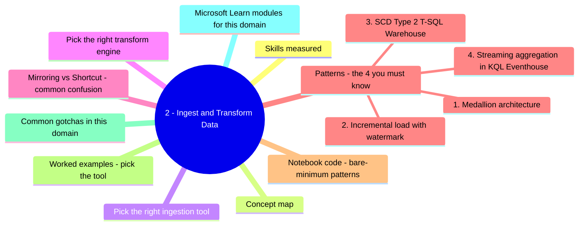
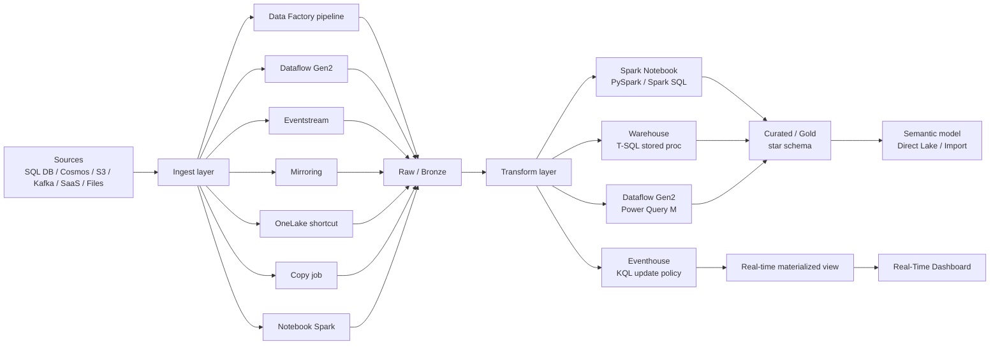
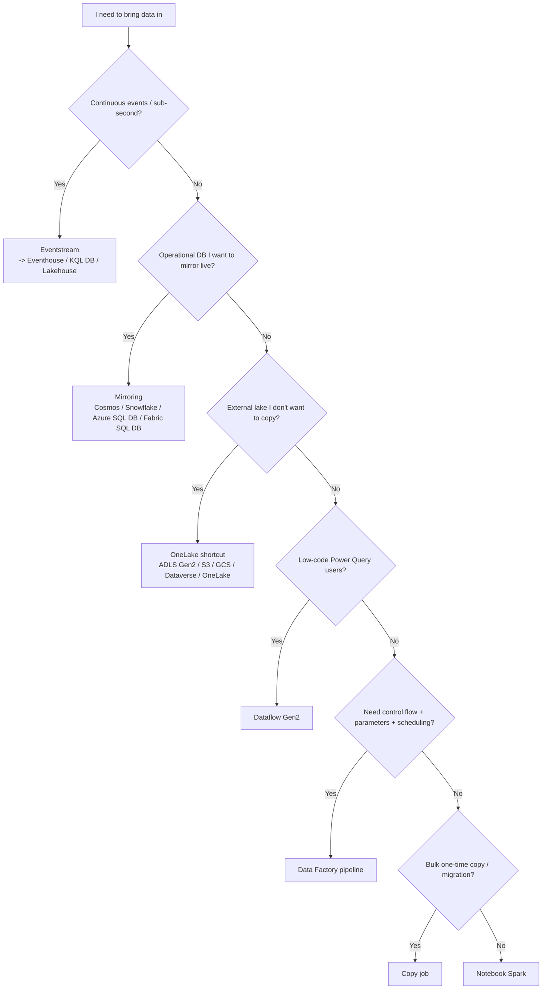
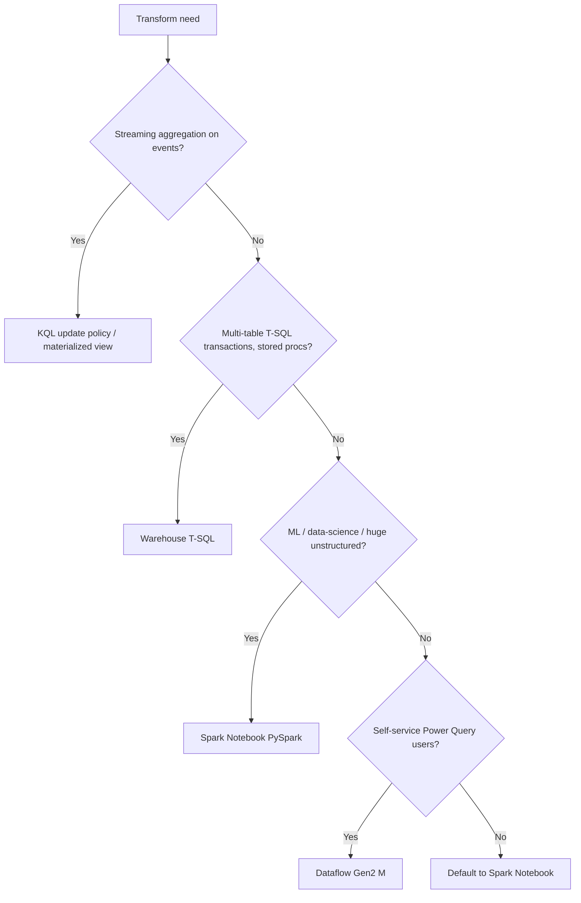
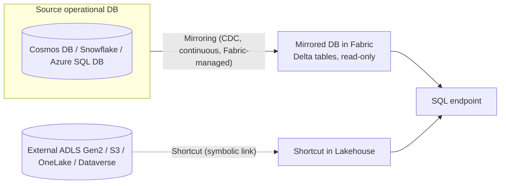
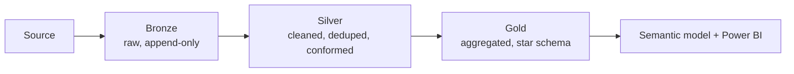
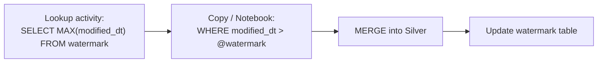

# 2 - Ingest and Transform Data

> Domain 2 of DP-700. Weight: **30-35%**. The "move it in, shape it" domain - pipelines, dataflows, eventstreams, mirroring, shortcuts, notebooks, T-SQL, KQL.


## Domain mind map



## Skills measured

- **Choose and implement an ingestion approach** - Data Factory pipelines, Dataflows Gen2, Eventstream, Mirroring, OneLake shortcuts, Copy job, Notebook ingestion.
- **Transform data by writing code** - PySpark / Spark SQL in Notebooks, T-SQL in Warehouse, Power Query M in Dataflows, KQL in Eventhouse.
- **Implement common patterns** - medallion (bronze / silver / gold), Slowly Changing Dimensions, incremental load, streaming aggregations, star schema.

> Source: [DP-700 study guide](https://learn.microsoft.com/credentials/certifications/resources/study-guides/dp-700).

---

## Concept map



---

## Pick the right ingestion tool



| Tool | Best when | Throughput | Latency | Code level |
|---|---|---|---|---|
| **Data Factory pipeline** | Orchestration with control flow, parameters, schedules | High | Minutes | Low-code (activities) |
| **Dataflow Gen2** | Self-service, Power Query users, lightweight transforms during ingest | Medium | Minutes | Low-code (M) |
| **Eventstream** | Continuous streams (Kafka, IoT, Custom App, Azure Event Hubs) | Very high | Sub-second | No-code |
| **Mirroring** | Replicate operational DB (Cosmos / Snowflake / Azure SQL DB / Fabric SQL DB) | Very high | Seconds | No-code |
| **OneLake shortcut** | Reference external lake without copying | Read-only | Live | None |
| **Copy job** | Bulk one-time copy with simple mapping | High | Minutes | No-code wizard |
| **Notebook (Spark)** | Custom code, complex transforms during ingest | High | Minutes | High-code (PySpark) |

---

## Pick the right transform engine



| Engine | Strengths | Weaknesses |
|---|---|---|
| **PySpark / Spark SQL Notebook** | Largest scale, full Python/Scala/R, ML libraries, Delta Lake | Cold start (custom pools), Python skill required |
| **Warehouse T-SQL** | Familiar SQL, multi-table transactions, stored procedures, MERGE | Not for ML / unstructured |
| **Dataflow Gen2 (M)** | Visual, citizen-developer friendly, broad connectors | Limited at large scale, M language |
| **KQL** | Time-series, log analytics, sub-second on billions of rows | Append-mostly model; not for transactional updates |

---

## Mirroring vs Shortcut - common confusion



| | Mirroring | Shortcut |
|---|---|---|
| **What** | Continuous CDC replication into a Fabric-owned Delta copy | Symbolic link to existing data in another lake |
| **Sources** | Cosmos DB, Snowflake, Azure SQL DB, Fabric SQL DB | ADLS Gen2, S3, GCS, Dataverse, another OneLake |
| **Storage cost** | Free (mirrored data) | Free (no duplication) |
| **Read latency** | Seconds (CDC lag) | Live source latency |
| **Write back?** | **No** (read-only in Fabric) | No (depends on source perms) |
| **When to pick** | "Want analytics on live OLTP without ETL" | "Want to query existing lake without moving data" |

---

## Patterns - the 4 you must know

### 1. Medallion architecture



| Layer | Owner | Format | Schema |
|---|---|---|---|
| **Bronze** | Ingest team | Delta append, raw column names | Source-shape |
| **Silver** | Data engineer | Delta upsert (MERGE), cleaned, conformed dims | Normalized |
| **Gold** | BI engineer | Delta aggregates / star schema fact + dims | Dimensional |

### 2. Incremental load with watermark



### 3. SCD Type 2 (T-SQL Warehouse)

```sql
MERGE INTO dim_customer AS tgt
USING stg_customer AS src
  ON tgt.customer_bk = src.customer_bk AND tgt.is_current = 1
WHEN MATCHED AND (tgt.address <> src.address OR tgt.email <> src.email)
  THEN UPDATE SET is_current = 0, end_date = SYSUTCDATETIME()
WHEN NOT MATCHED BY TARGET
  THEN INSERT (customer_bk, address, email, is_current, start_date, end_date)
       VALUES (src.customer_bk, src.address, src.email, 1, SYSUTCDATETIME(), NULL);

-- second pass: insert new current rows for the changed records
INSERT INTO dim_customer (customer_bk, address, email, is_current, start_date, end_date)
SELECT customer_bk, address, email, 1, SYSUTCDATETIME(), NULL
FROM stg_customer s
WHERE EXISTS (SELECT 1 FROM dim_customer d
              WHERE d.customer_bk = s.customer_bk AND d.is_current = 0
                AND d.end_date = SYSUTCDATETIME());
```

### 4. Streaming aggregation in KQL (Eventhouse)

```kusto
// 5-minute tumbling count of sensor errors per device
sensor_events
| where event_type == "error"
| summarize cnt = count() by device_id, bin(timestamp, 5m)
```

Materialize via update policy so downstream Power BI hits a precomputed table.

---

## Notebook code - bare-minimum patterns

```python
# PySpark - read from Lakehouse Files, write to Tables
df = spark.read.option("header", True).csv("Files/raw/orders/*.csv")

clean = (df
  .dropDuplicates(["order_id"])
  .withColumnRenamed("ord_dt", "order_date")
  .filter("amount > 0"))

(clean.write
  .mode("overwrite")
  .format("delta")
  .saveAsTable("silver_orders"))
```

```python
# Spark SQL inside the notebook
spark.sql("""
  MERGE INTO gold_customer t
  USING silver_customer s
    ON t.customer_id = s.customer_id
  WHEN MATCHED THEN UPDATE SET *
  WHEN NOT MATCHED THEN INSERT *
""")
```

---

## Worked examples - pick the tool

| Scenario | Pick |
|---|---|
| Replicate Cosmos DB into Fabric for ad-hoc analytics, no ETL. | **Mirroring**. |
| Read S3 parquet without copying. | **OneLake shortcut**. |
| Daily on-prem SQL extraction with parameterized dates and 5-step orchestration. | **Data Factory pipeline** (with on-prem data gateway). |
| Self-service ingestion by a finance analyst familiar with Power Query. | **Dataflow Gen2**. |
| 50K events/sec from IoT to a real-time dashboard. | **Eventstream -> Eventhouse -> Real-Time Dashboard**. |
| Convert raw CSV to clean Delta tables using PySpark for an ML team. | **Notebook**. |
| Bulk migrate 200 tables from Synapse Dedicated Pool to Warehouse. | **Copy job** (or pipeline with For Each + Copy). |
| Build SCD Type 2 dimension. | **Warehouse T-SQL MERGE** or **Spark Delta MERGE**. |
| Maintain a 1-min rolling average of telemetry. | **KQL update policy / materialized view** in Eventhouse. |

---

## Common gotchas in this domain

- **Lakehouse SQL endpoint is read-only.** `INSERT/UPDATE/DELETE` against the SQL endpoint of a Lakehouse fails. Write through Spark or via the Warehouse.
- **Dataflow Gen2 destination is required for the data to land** - without a destination, results are computed but not stored.
- **Pipeline `Copy` activity != Copy job.** Copy activity is one task in a pipeline; Copy job is a standalone item with simpler scheduling.
- **Mirroring lag** depends on source CDC capability - typical seconds, but spikes happen with very high write rates.
- **Shortcuts respect source permissions.** A shortcut to ADLS Gen2 honors RBAC on the source folder.
- **`MERGE` in Lakehouse** requires Spark; the Lakehouse SQL endpoint cannot run MERGE. Use Warehouse for SQL-only MERGE.
- **Default V-Order is on for new tables** - keep it on unless you have a write-heavy workload that never reads via Direct Lake.
- **Notebook session timeout** - default ~20 min idle. Long pipelines should use *Pipeline Notebook* activity which manages the session.
- **Eventstream -> Lakehouse** lands data as Delta; `->` Eventhouse lands it as KQL ingestion. Pick the destination that matches your query engine.

---

## Microsoft Learn modules for this domain

- [Ingest data with Microsoft Fabric](https://learn.microsoft.com/training/paths/ingest-data-fabric/)
- [Get started with Real-Time Intelligence in Microsoft Fabric](https://learn.microsoft.com/training/paths/explore-real-time-analytics-fabric/)
- [Use Apache Spark to work with files in a lakehouse](https://learn.microsoft.com/training/modules/use-apache-spark-work-files-lakehouse/)
- [Get started with Data Warehouse in Microsoft Fabric](https://learn.microsoft.com/training/paths/get-started-data-warehouse-microsoft-fabric/)
- [Mirroring in Microsoft Fabric](https://learn.microsoft.com/fabric/database/mirrored-database/overview)
- [OneLake shortcuts](https://learn.microsoft.com/fabric/onelake/onelake-shortcuts)

---

[<- Implement and Manage](01-implement-manage.md) - [Monitor and Optimize ->](03-monitor-optimize.md)
