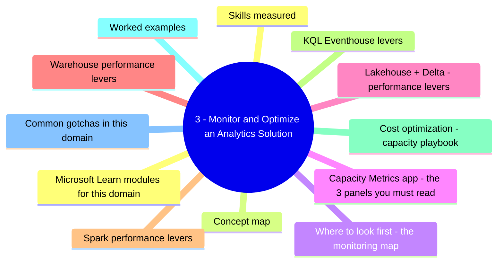
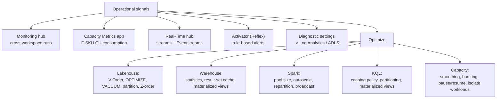
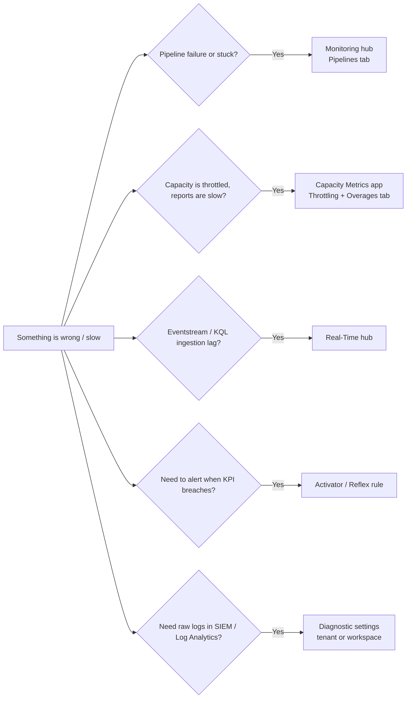
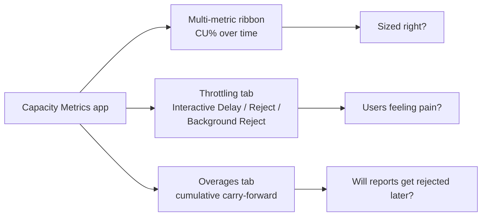
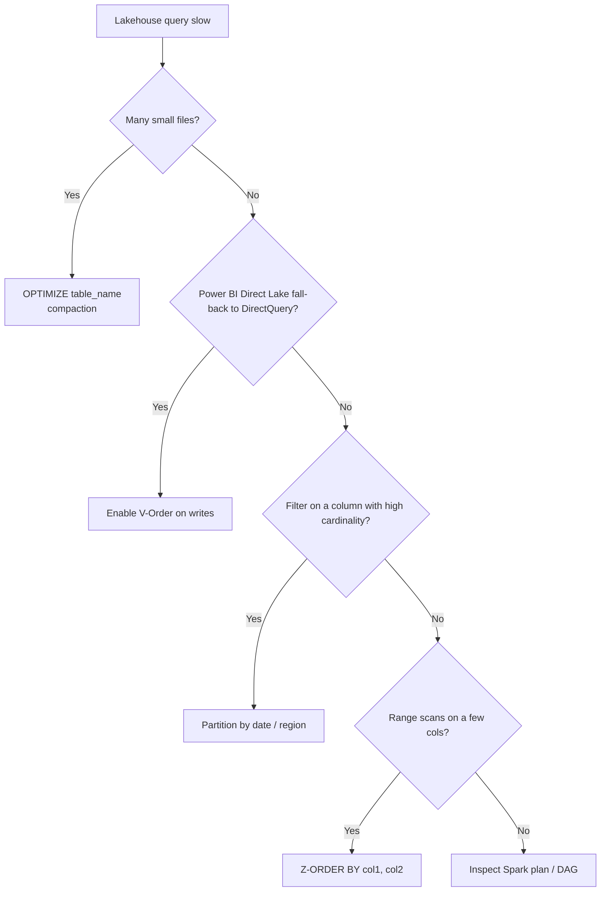
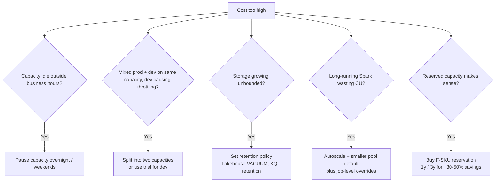

# 3 - Monitor and Optimize an Analytics Solution

> Domain 3 of DP-700. Weight: **30-35%**. The "see what's running and make it faster / cheaper" domain - Monitoring hub, Capacity Metrics, Spark tuning, Delta optimization, Warehouse stats, KQL caching.


## Domain mind map



## Skills measured

- **Monitor Fabric items** - Monitoring hub, pipeline run history, Real-Time hub, Activator, Capacity Metrics app, diagnostic settings to Log Analytics.
- **Identify and resolve errors** - pipeline failures, Spark job errors, refresh failures, throttling.
- **Optimize performance** - V-Order, OPTIMIZE / VACUUM Delta, partitioning, statistics, result-set cache, Spark pool sizing, query plan analysis.
- **Optimize cost** - capacity smoothing / bursting, pause/resume, workload isolation, storage retention.

> Source: [DP-700 study guide](https://learn.microsoft.com/credentials/certifications/resources/study-guides/dp-700).

---

## Concept map



---

## Where to look first - the monitoring map



| Tool | Scope | Best for |
|---|---|---|
| **Monitoring hub** | Tenant-wide, across workspaces | "Find the failed pipeline run last night." |
| **Item run history** | Single item | "What was the parameter set on pipeline run X?" |
| **Capacity Metrics app** | Per F-SKU | "Why is my capacity throttling between 09:00 and 11:00?" |
| **Real-Time hub** | All streams | "Inspect Eventstream throughput and lag." |
| **Activator** | Rules over streams / Power BI / KQL | "Page on-call when failed-orders > 50 in 5 min." |
| **Diagnostic settings** | Workspace -> Log Analytics / ADLS / Event Hubs | Long-term retention, correlation across services, KQL alerting. |

---

## Capacity Metrics app - the 3 panels you must read



| Throttling state | Meaning | Action |
|---|---|---|
| **Interactive Delay** | Reports start to slow down | Watch - capacity is borrowing from future |
| **Interactive Reject** | Power BI queries are rejected | Scale up immediately or reduce concurrency |
| **Background Reject** | Pipelines / refreshes rejected | Stagger schedules or scale up |

> **Smoothing** - interactive ops smoothed over 5 min, background ops over 24h. **Bursting** lets a single op exceed CU briefly, repaid via smoothing.

---

## Lakehouse + Delta - performance levers



| Lever | What it does | When |
|---|---|---|
| **V-Order** | Fabric-specific Parquet sort, accelerates Direct Lake / VertiPaq read | On by default for new Lakehouse tables. |
| **OPTIMIZE** | Compacts many small files into ~1 GB target files | After heavy append / streaming ingestion. |
| **VACUUM** | Removes old file versions older than retention (default 7 days) | After OPTIMIZE; reclaim storage. |
| **Partition** | Physical folder split by column (date, region) | Filter predicate is the partition column. |
| **Z-ORDER** | Co-locates rows with similar values in same files | Range / equality on a few columns. |
| **Optimize Write** | Auto small-file coalescing during write | On for default Spark sessions. |

> **Trap:** Over-partitioning = many tiny files = worse performance. Aim for partition values with **at least 1 GB** each.

---

## Warehouse performance levers

| Lever | When |
|---|---|
| **Update statistics** | Plan looks bad; cardinality estimates wrong. `CREATE STATISTICS` / `UPDATE STATISTICS`. |
| **Result-set cache** | Re-runs of identical SELECTs return cached result instantly. On by default; no config. |
| **Materialized view** | Frequent aggregation on huge fact table. |
| **Inspect query plan** | `EXPLAIN` (preview) or query insights view. |
| **Distribute / partition** | Auto-managed in Fabric Warehouse - no manual hash distribution like Synapse Dedicated. |

---

## Spark performance levers

```mermaid
flowchart LR
    Slow[Spark notebook slow / OOM]
    Slow --> A1[Increase pool node size<br/>or use custom pool]
    Slow --> A2[Enable autoscale + dynamic allocation]
    Slow --> A3[repartition df to balance skew]
    Slow --> A4[broadcast small dim joins]
    Slow --> A5[Cache reused intermediate df]
    Slow --> A6[Avoid collect() on large df]
```

| Symptom | Likely fix |
|---|---|
| Cold-start delay (~2-3 min) | Use **starter pool** (always warm) for short interactive jobs; custom pool for prod. |
| Out-of-memory on join | **Broadcast** the small dim (`broadcast(small_df)`); or partition the big side. |
| Skew on a few keys | `salt` the skewed key, or `repartitionByRange`. |
| Re-reads same df 5 times | `df.cache()` or `persist(StorageLevel.MEMORY_AND_DISK)`. |
| Long shuffles | Increase shuffle partitions (`spark.sql.shuffle.partitions`); enable AQE. |

---

## KQL / Eventhouse levers

| Lever | Purpose |
|---|---|
| **Caching policy** | Hot vs cold tiering - keep recent data in SSD cache. |
| **Partitioning policy** | High-cardinality string column -> partition by hash for parallel scan. |
| **Materialized view** | Precompute aggregates served sub-second. |
| **Update policy** | Transform on ingest into a derived table. |
| **Retention policy** | Auto-purge to control storage cost. |

---

## Cost optimization - capacity playbook



| Lever | When | Savings |
|---|---|---|
| **Pause capacity** | Dev/test idle hours | Pay only for storage |
| **Workload isolation** | Prevent dev from throttling prod | Right-size each capacity |
| **Reserved F-SKU** | Steady-state production | ~30-50% off PAYG |
| **Storage retention** | Logs, telemetry, soft-deleted Delta versions | Per-GB savings |
| **Smoothing-aware scheduling** | Stagger refreshes, off-peak ETL | Avoid bursts -> smaller F-SKU |

---

## Worked examples

| Scenario | Action |
|---|---|
| Power BI report slow Mondays 09:00; capacity at 100% CU. | **Capacity Metrics -> Throttling tab**; either scale up F-SKU or stagger refresh schedules. |
| New Lakehouse table queried by Direct Lake falls back to DirectQuery. | Verify **V-Order on**; run **OPTIMIZE**; check supported data types. |
| Daily Spark job runs 2x longer over weeks. | Run **OPTIMIZE + VACUUM** on Bronze; check small-file count; review broadcast joins. |
| Pipelines failing at 02:00 with "Background Reject". | Capacity overcommitted; reschedule, scale up, or split workloads. |
| KQL dashboard slow on 90-day query. | Add **caching policy** for last 90 days; build **materialized view** for the hot aggregation. |
| Want page-on-call when failed-orders KPI > 50 in 5 min. | **Activator** rule on Power BI metric or KQL output. |
| Need to send Fabric audit logs to SIEM. | Configure **diagnostic settings** at tenant -> Log Analytics / Event Hubs. |
| Storage cost grew 5x in 3 months on Lakehouse. | Run **VACUUM** with default 7-day retention; verify no orphan dataflow staging. |

---

## Common gotchas in this domain

- **VACUUM default retention is 7 days.** Setting lower needs `spark.databricks.delta.retentionDurationCheck.enabled = false` AND a real reason. Lower retention breaks time travel.
- **Time travel** (`VERSION AS OF` / `TIMESTAMP AS OF`) only works as far back as your VACUUM retention.
- **V-Order costs ~15% extra write CPU** but typically pays back many-fold on read. Disable only for write-heavy never-read tables.
- **Capacity Metrics is itself an item** that consumes CU - install it on a separate capacity if your prod is already strained.
- **Diagnostic settings are configured per tenant or per workspace** - they're not enabled by default.
- **Activator alerts can call Power Automate, Teams, or custom endpoints** - not raw email; pick the channel up front.
- **Spark autoscale != instant.** Adding executors takes seconds; design pipelines to tolerate.
- **Result-set cache invalidates on data change** in the underlying tables - fine-grained at the partition.
- **Mirroring lag is observable in Real-Time hub**; alert on it via Activator.

---

## Microsoft Learn modules for this domain

- [Monitor activities in Microsoft Fabric](https://learn.microsoft.com/training/modules/monitor-fabric/)
- [Use the Microsoft Fabric Capacity Metrics app](https://learn.microsoft.com/fabric/enterprise/metrics-app)
- [Optimize a Lakehouse for analytics](https://learn.microsoft.com/training/modules/optimize-lakehouse-tables-microsoft-fabric/)
- [Tune Apache Spark in Microsoft Fabric](https://learn.microsoft.com/fabric/data-engineering/spark-tuning)
- [Implement real-time analytics with KQL](https://learn.microsoft.com/training/paths/explore-real-time-analytics-fabric/)
- [Get started with Data Activator](https://learn.microsoft.com/training/paths/get-started-data-activator/)

---

[<- Ingest and Transform](02-ingest-transform.md) - [Exam Cheatsheet ->](05-exam-cheatsheet.md)
