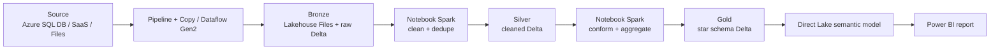
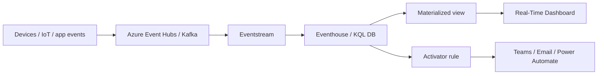
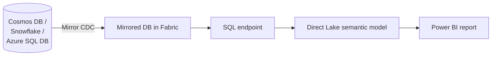
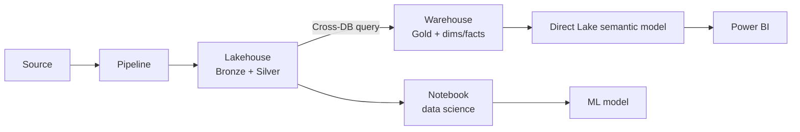
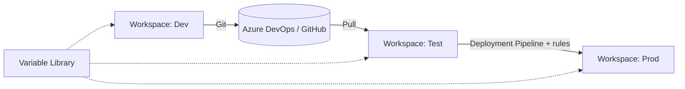
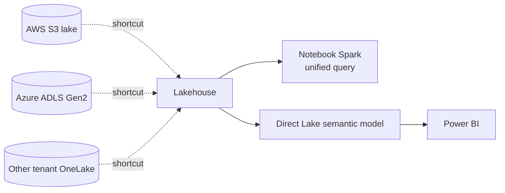
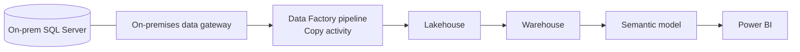
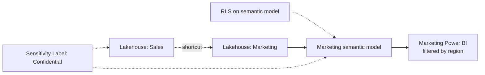
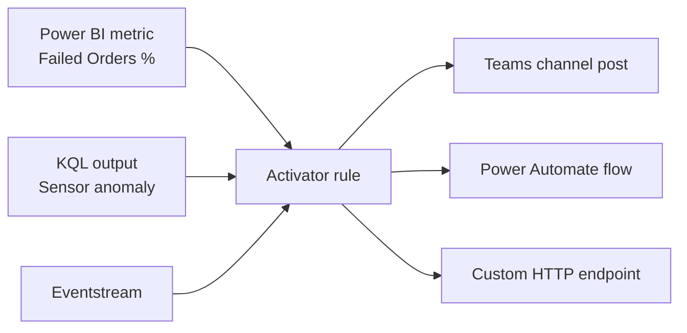
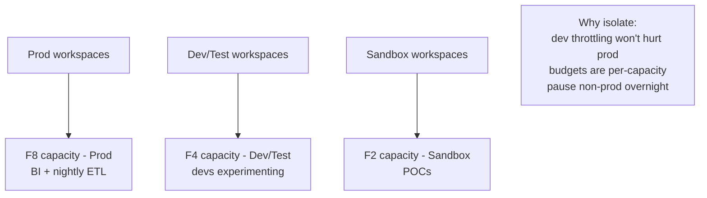

# Reference Architectures - DP-700

> Canonical Fabric architectures you should be able to draw on a whiteboard.

## 1. Medallion Lakehouse (batch ETL)

## 2. Real-time intelligence (streaming)

## 3. Mirroring + Direct Lake (zero-ETL analytics)

## 4. Hybrid: Lakehouse + Warehouse

## 5. CI/CD with Git + Deployment Pipelines

## 6. Cross-cloud lake federation via shortcuts

## 7. Ingest from on-premises

## 8. Secure data sharing across business units

## 9. Activator end-to-end (operational alerting)

## 10. Capacity isolation strategy

---

[<- Learn Summaries](08-learn-summaries.md) - [Microsoft Resources ->](11-microsoft-resources.md)
